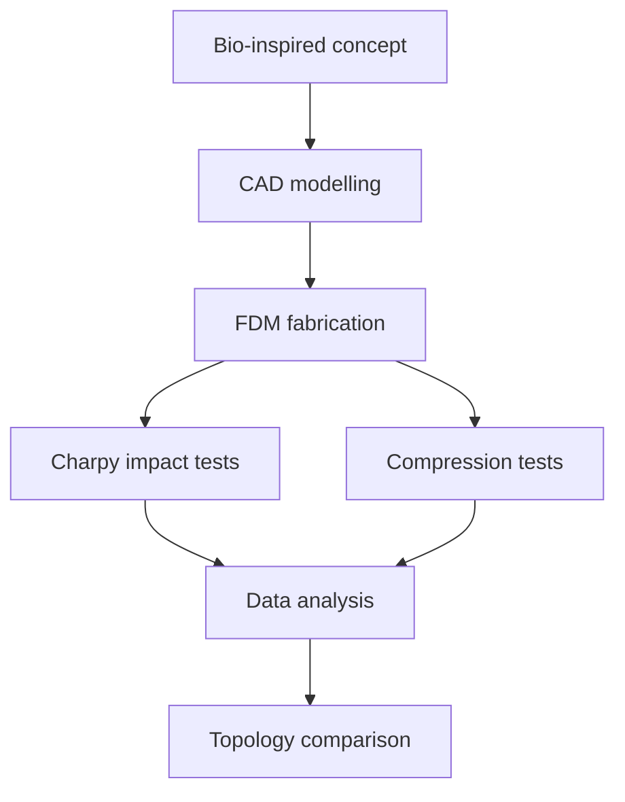
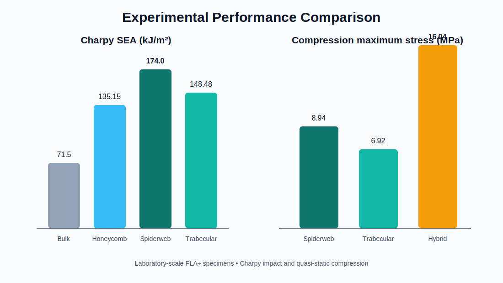

# Muhammad Jalal — Mechanical Engineering Portfolio

Mechanical engineering portfolio focused on **auxetic structures, additive manufacturing, experimental mechanics, MATLAB, CAD, and finite element analysis**.

## Featured final-year design project

### Design and Development of Additively Manufactured Auxetic Structures for Enhanced Compression and Impact Performance

This team project investigated whether bio-inspired internal geometries can improve the impact and compression response of lightweight 3D-printed PLA+ structures.

> **Technical scope:** The impact work used laboratory-scale Charpy testing. It demonstrates comparative impact-energy absorption, not certified ballistic or armour performance.

### Project at a glance

| Area | Details |
|---|---|
| Structures | Spiderweb-inspired, trabecular bone-inspired, hybrid, honeycomb and bulk reference |
| Material | PLA+ |
| Manufacturing | FDM/FFF using a CreatBot F430 |
| Impact testing | Charpy pendulum testing |
| Compression testing | Quasi-static testing using a universal testing machine |
| Design and analysis | CAD, ANSYS, ImageJ and engineering calculations |
| Standards referenced | ISO 179 and ASTM D695 |

### Research workflow

### Key findings

#### Charpy impact performance

| Structure | Absorbed energy (J) | SEA (kJ/m²) | Improvement vs. bulk |
|---|---:|---:|---:|
| Bulk reference | 0.118 | 71.50 | Baseline |
| Honeycomb | 0.223 | 135.15 | 89% |
| Spiderweb-inspired | **0.287** | **174.00** | **143%** |
| Trabecular-inspired | 0.245 | 148.48 | 108% |

The spiderweb-inspired design produced the highest measured Charpy absorbed energy and specific energy absorption.

#### Quasi-static compression performance

| Structure | Young’s modulus (MPa) | Plateau stress (MPa) | Maximum stress (MPa) |
|---|---:|---:|---:|
| Spiderweb-inspired | **63.30** | **3.20** | 8.94 |
| Trabecular-inspired | 59.53 | 2.42 | 6.92 |
| Hybrid | 61.81 | 2.96 | **16.04** |

The hybrid topology produced the highest reported compression energy-absorption result, while the spiderweb structure showed the highest stiffness and plateau stress.

### Engineering interpretation

- **Spiderweb:** strongest candidate among the tested designs for comparative impact resistance.
- **Hybrid:** strongest candidate for quasi-static compression energy absorption.
- **Trabecular:** balanced response with lower plateau stress and extended deformation.
- **Design lesson:** the best internal topology depends on the loading condition.

[Read the detailed project overview](projects/auxetic-structures.md) · [View the summarized data](data/experimental-summary.csv)

## Skills demonstrated

- Mechanical design and CAD modelling
- Auxetic and bio-inspired cellular structures
- FDM/FFF additive manufacturing
- ANSYS-based structural analysis
- Charpy impact testing
- Quasi-static compression testing
- Stress–strain and energy-absorption analysis
- MATLAB, ImageJ and engineering data presentation
- Technical reporting and presentation

## Project credit

This was a team final-year design project completed in the Department of Mechanical Engineering at Sarhad University of Science and Information Technology.

**Student team:** Sajid-ur-Rehman, Abdullah and Muhammad Jalal  
**Supervisor:** Engr. Aftab Ahmad  
**Co-supervisor:** Dr. Babar Ashfaq

The impact-focused work was also presented as *Experimental Investigation of Impact Performance in Bio-Inspired 3D-Printed Negative Poisson Ratio Structures: A Comparative Study with Conventional Structures* at the 4th International Conference on Modern Technologies in Mechanical & Material Engineering, GIK Institute, May 2026.

## Repository purpose

This public repository is a concise professional portfolio. Complete thesis documents, editable presentations, raw research data and confidential project files remain private.

## Contact

- GitHub: [chyayat263-png](https://github.com/chyayat263-png)
- LinkedIn: [Muhammad Jalal](https://www.linkedin.com/in/engrm-jalal-7970463b3)

## Use notice

Portfolio content is provided for professional and educational viewing. No permission is granted to reproduce or submit this academic work as another person’s work. See [NOTICE.md](NOTICE.md).
